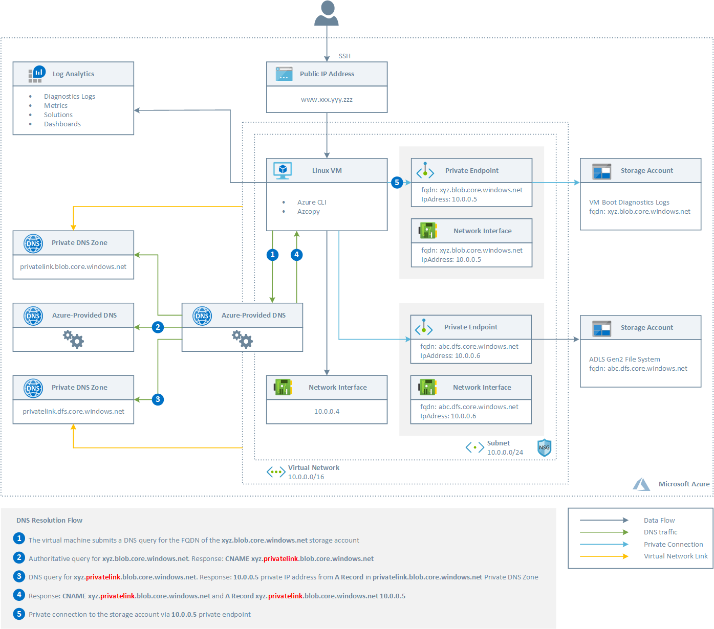
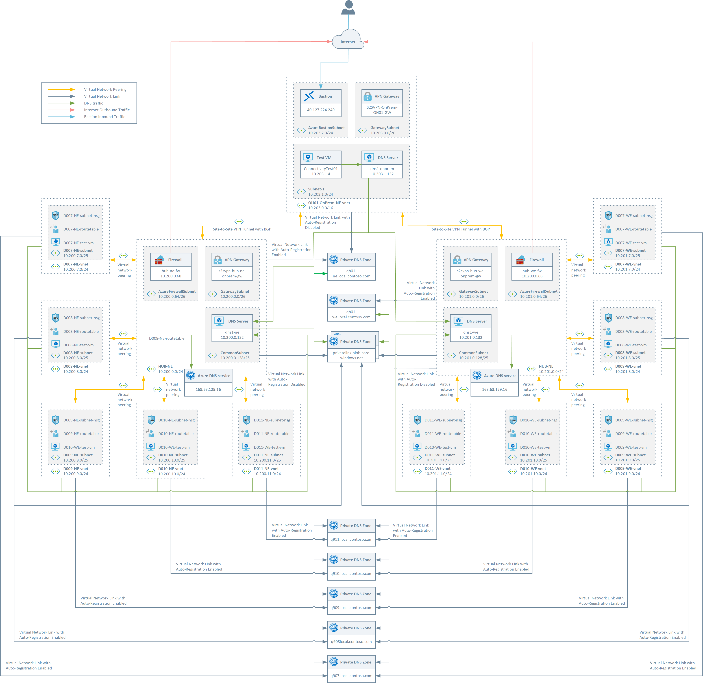
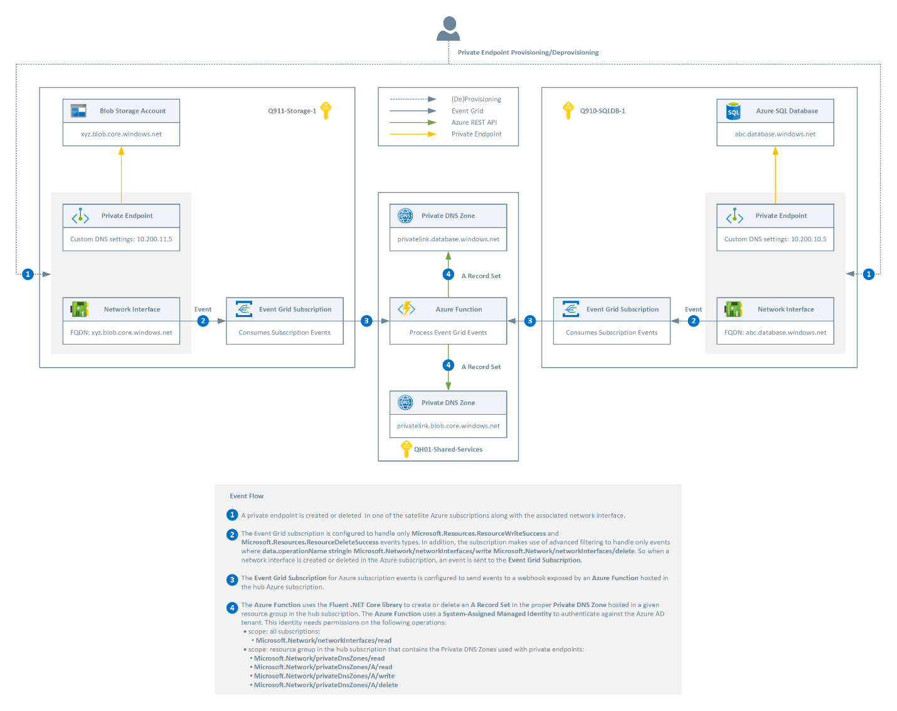
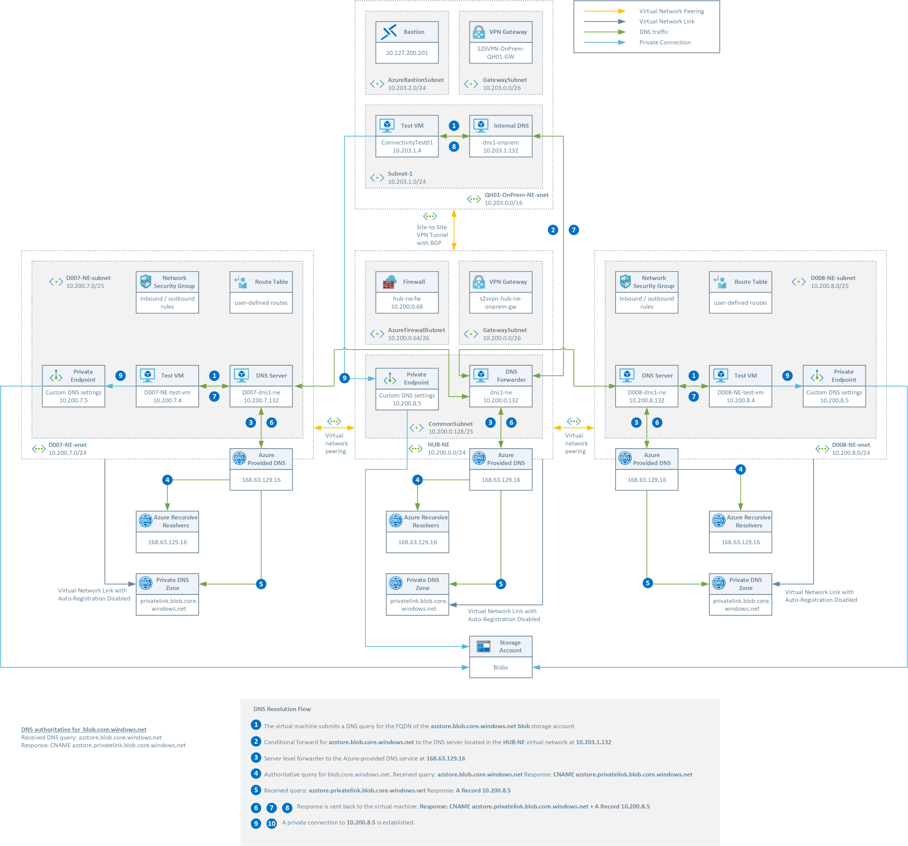
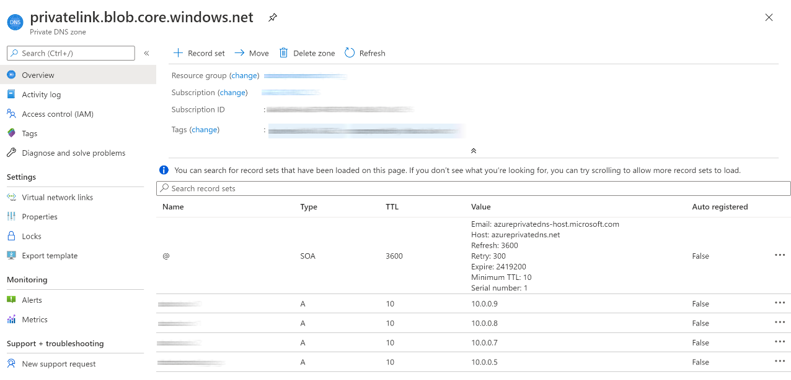
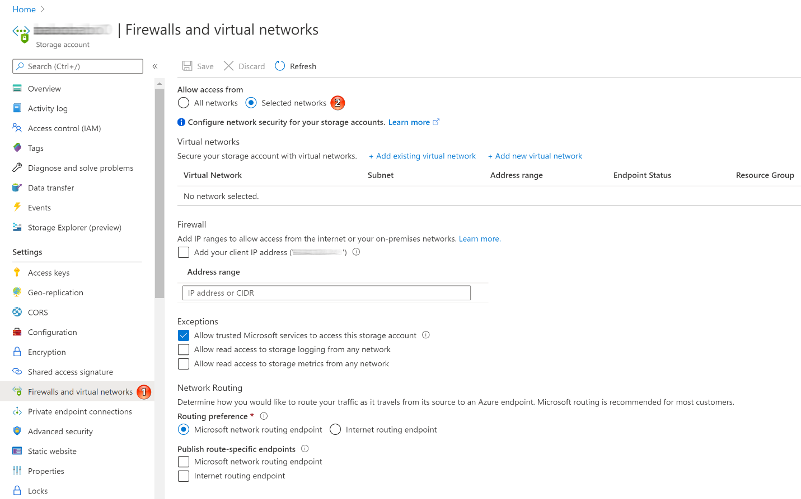

<style>
pre code,
.md:not(.use-csslab) pre code
 {
  white-space: pre-wrap;
}
</style>
# Centralized vs Decentralized Private DNS Zones

The objective of this article is to define a solution for the
management of Azure Private Endpoints and Private DNS Zones in a complex
hub-and-spoke network topology. In this context, application team users
have limited permissions in the spoke virtual networks and read-only
permissions on the resources in the hub virtual network.  The final
objective is to let individual application teams to create and scale
Azure resources within their Azure subscription or landing zone without
the need to interact with the platform team (SysOps, NetOps, and SecOps)
via tickets and any manual or automated approval process. The platform
team defines and implements the guard rails on subscriptions in which
the application team can operate. Application team users operate
autonomously within those guard rails in their subscriptions. Centrally
managed components for implementing guard rails and shared services
include [Management Groups](https://docs.microsoft.com/en-us/azure/governance/management-groups/overview), [Policies](https://docs.microsoft.com/en-us/azure/governance/policy/overview), [Blueprints](https://docs.microsoft.com/en-us/azure/governance/blueprints/overview), [Template Specs](https://docs.microsoft.com/en-us/azure/azure-resource-manager/templates/template-specs?tabs=azure-powershell), and shared services
like the Hub virtual network, Azure Firewall, and DNS server. The goal
is to maximize the autonomy and agility of individual application teams
by minimizing centrally managed processes and thus reduce the
operational burden on central IT.

The conclusion of our investigation is that the centralized model for
managing Private DNS Zones should be used as a reference approach, while
the decentralized model should only be adopted when application teams
have very strict requirements in terms of workload isolation,
sandboxing, and security of private endpoints. The lifecycle of the DNS
records required by private endpoints can be entirely managed via Azure
Policy and
[PrivateDnsZoneGroup](https://docs.microsoft.com/en-us/azure/templates/microsoft.network/2020-05-01/privateendpoints/privatednszonegroups)
as explained in the second part of the present article. For more information on DNS configuration of private endpoints, see
[Azure Private Endpoint DNS configuration](https://docs.microsoft.com/en-us/azure/private-link/private-endpoint-dns) and in particular [Virtual network and on-premises workloads using a DNS forwarder](https://docs.microsoft.com/en-us/azure/private-link/private-endpoint-dns#virtual-network-and-on-premises-workloads-using-a-dns-forwarder).

## Scenario

Contoso Ltd has started a journey to assess and migrate workloads to
Azure with the goal of de-commissioning their on-premises data center
within the upcoming years. Contoso is building a custom datacenter
control plane platform for Azure to provide foundational guard rails,
services, and infrastructure on Azure for the entire company. Contoso is
employing a top-down, business aligned, application centric approach to
application migrations and transformations. This approach will help
product owners and application teams control their own transformation
pace, agility, and autonomy when moving to Azure. The datacenter control
plane adheres to the following characteristics and is aligned with the
principles of the [Cloud Adoption
Framework](https://docs.microsoft.com/en-us/azure/cloud-adoption-framework/ready/enterprise-scale/design-principles):

- Empower application teams to run, operate, and monitor their
    workloads autonomously.
- Single control plane using Azure-native components ([Policies](https://docs.microsoft.com/en-us/azure/governance/policy/overview), [Blueprints](https://docs.microsoft.com/en-us/azure/governance/blueprints/overview), [Template Specs](https://docs.microsoft.com/en-us/azure/azure-resource-manager/templates/template-specs?tabs=azure-powershell), [ARM Templates](https://docs.microsoft.com/en-us/azure/azure-resource-manager/templates/overview), [Azure Active Directory](https://docs.microsoft.com/en-us/azure/active-directory/fundamentals/active-directory-whatis), [Azure Security Center](https://docs.microsoft.com/en-us/azure/security-center/security-center-introduction))
- Supports Cloud Operating Model from the start including NetOps,
    AppOps, and DevOps
- Sustainable and scalable across the globe
- Secure and compliant by design

The Contoso cloud environment is composed of hundreds of subscriptions
organized in hierarchy of [Management Groups](https://docs.microsoft.com/en-us/azure/governance/management-groups/overview) by compliance requirements.
Contoso built a custom datacenter control plane for Azure that
implements infrastructure automation which includes CI/CD pipelines to
deploy and manage Management Group hierarchies, [Azure Policies](https://docs.microsoft.com/en-us/azure/governance/policy/overview), Azure
[Blueprints](https://docs.microsoft.com/en-us/azure/governance/blueprints/overview) or [Template Specs](https://docs.microsoft.com/en-us/azure/azure-resource-manager/templates/template-specs?tabs=azure-powershell) as well as company-wide shared services (i.e. central
Firewalls, hub networks, cross-premises connectivity across multiple
regions) as follows:

- [Blueprints](https://docs.microsoft.com/en-us/azure/governance/blueprints/overview) or [Template Specs](https://docs.microsoft.com/en-us/azure/azure-resource-manager/templates/template-specs?tabs=azure-powershell) are used to deploy patterns based on requirements to
    target landing zones. As such, [Blueprints](https://docs.microsoft.com/en-us/azure/governance/blueprints/overview) are defined and assigned
    to subscriptions handed out to application teams to enforce
    deployment of resources required for landing zones based on landing
    zone type. Such resources include but are not limited to: Virtual
    Networks, NSGs, UDRs, Log Analytics Workspaces, Network Watchers
    etc.
- [Azure Policies](https://docs.microsoft.com/en-us/azure/governance/policy/overview) are assigned at Management Group and Subscription
    levels to enforce organizational standards and legal requirements
    and to assess compliance of Azure resources at-scale while being
    able to delegate regular AppOps or DevOps procedures to application
    teams.

## Azure Private Links 

### Overview

Azure Private Link is a networking technology that enables applications
running on-premises or in the cloud to access a
[list](https://docs.microsoft.com/en-us/azure/private-link/private-link-overview#availability)
of Azure services (for example, Storage Account or and SQL Database) and
Azure hosted customer-owned/partner services over a [private
endpoint](https://docs.microsoft.com/en-us/azure/private-link/private-endpoint-overview) defined
in a virtual network. When you\'re connecting to a private link resource
using its fully qualified domain name (FQDN) as part of the connection
string, it\'s important to correctly configure your DNS settings to
resolve the FQDN to the allocated private IP address. For more
information on this, see [Azure Private Endpoint DNS
configuration](https://docs.microsoft.com/en-us/azure/private-link/private-endpoint-dns).
Traffic between the virtual network and the service travels the
Microsoft backbone network.

Azure Private Link provides the following benefits:

- **Privately access services on the Azure platform**: Connect your
virtual network to services in Azure without a public IP address
at the source or destination. Service providers can render their
services in their own virtual network and consumers can access
those services in their local virtual network. The Private Link
platform will handle the connectivity between the consumer and
services over the Azure backbone network.

- **On-premises and peered networks**: Access services running in
Azure from on-premises over ExpressRoute private peering, VPN
tunnels, and peered virtual networks using private endpoints.
There\'s no need to set up public peering or traverse the internet
to reach the service. Private Link provides a secure way to
migrate workloads to Azure.

- **Protection against data leakage**: A private endpoint is mapped to
an instance of a PaaS resource instead of the entire service.
Consumers can only connect to the specific resource. Access to any
other resource in the service is blocked. This mechanism provides
protection against data leakage risks.

- **Global reach**: Connect privately to services running in other
regions. The consumer\'s virtual network could be in region A and
it can connect to services behind Private Link in region B.

- **Extend to your own services**: Enable the same experience and
functionality to render your service privately to consumers in
Azure. By placing your service behind a standard Azure Load
Balancer, you can enable it for Private Link. The consumer can
then connect directly to your service using a private endpoint in
their own virtual network. You can manage the connection requests
using an approval call flow. Azure Private Link works for
consumers and services belonging to different Azure Active
Directory tenants.

For more information on Private Link and Private Endpoints, see the
following resources:

- [What is Azure Private
    Link?](https://docs.microsoft.com/en-us/azure/private-link/private-link-overview)
- [What is Azure Private
    Endpoint?](https://docs.microsoft.com/en-us/azure/private-link/private-endpoint-overview)
- [What is Azure Private Link
    service?](https://docs.microsoft.com/en-us/azure/private-link/private-link-service-overview)
- [Azure Private Endpoint DNS
    configuration](https://docs.microsoft.com/en-us/azure/private-link/private-endpoint-dns)

### Private Endpoints

Azure Private Endpoint is a network interface that connects applications
privately and securely to an Azure service powered by Azure Private
Link. Private Endpoint uses a private IP address from a virtual network,
effectively bringing the service into your virtual network. The service
could be an Azure service such as Azure Storage, Azure Cosmos DB, SQL,
etc. or your own Private Link Service. Here are some key details about
private endpoints:

- Private endpoint enables connectivity between the consumers from the
same VNet, regionally peered VNets, globally peered VNets and on
premises
using [VPN](https://azure.microsoft.com/services/vpn-gateway/) or [Express
Route](https://azure.microsoft.com/services/expressroute/) and
services powered by Private Link.

- Network connections can only be initiated by clients connecting to
the Private endpoint, Service providers do not have any routing
configuration to initiate connections into service consumers.
Connections can only be established in a single direction.

- As shown in the picture below, when creating a private endpoint, a
read-only network interface is also created for the lifecycle of
the resource. By convention, the name of this network interface is
equal to \<private-endpoint-name\>.nic.\<unique-identifier\>. The
interface is assigned dynamically a private IP address from the
subnet that maps to the private link resource. The value of the
private IP address remains unchanged for the entire lifecycle of
the private endpoint.
- The private endpoint must be deployed in the same region as the
virtual network.
- The private link resource can be deployed in a different region than
the virtual network and private endpoint.
- Multiple private endpoints can be created using the same private
link resource. For a single network using a common DNS server
configuration, the recommended practice is to use a single private
endpoint for a given private link resource to avoid duplicate
entries or conflicts in DNS resolution.
- Multiple private endpoints can be created on the same or different
subnets within the same virtual network. There are limits to the
number of private endpoints you can create in a subscription. For
details, see [Azure
limits](https://docs.microsoft.com/en-us/azure/azure-resource-manager/management/azure-subscription-service-limits#networking-limits).
- The [PrivateDnsZoneGroup](https://docs.microsoft.com/en-us/azure/templates/microsoft.network/privateendpoints/privateDnsZoneGroups) resource
type establishes a relationship between the Private Endpoint and
the Private DNS zone used for the name resolution of the fully
qualified name of the resource referenced by the Private Endpoint.
The
[PrivateDnsZoneGroup](https://docs.microsoft.com/en-us/azure/templates/microsoft.network/privateendpoints/privateDnsZoneGroups) is
a sub-resource or child-resource of a Private Endpoint. The
PrivateDnsZoneGroup type a single property that contains the
resource if of the referenced Private DNS Zone. The user that
creates a PrivateDnsZoneGroup requires write permission on the
private DNS Zone. Once created, this resource is used to manage
the lifecycle of the DNS A record used to resolve the fully
qualified name of the resource referenced by the Private Endpoint.
When creating a Private Endpoint, the related A record will
automatically be created in the target Private DNS Zone with the
private IP address of the network interface associated to the
Private Endpoint and the name of the Azure resource referenced by
the Private Endpoint. When deleting a Private Endpoint, the
related A record gets automatically deleted from the corresponding
Private DNS Zone. The network resource provider
(Microsoft.Network) identity is used to perform both operations.
This means that the user provisioning a Private Endpoint doesn't
require any write permissions on the Private DNS Zone or it's A
records.



### Samples

The following ARM templates under Azure Quickstart Templates GitHub
account demonstrate how to properly deploy and configure private
endpoints on Azure:

1.[Blob Storage
    Account](https://github.com/Azure/azure-quickstart-templates/tree/master/201-blob-storage-private-endpoint)
2.[ADLS Gen2 File
    System](https://github.com/Azure/azure-quickstart-templates/tree/master/201-blob-storage-private-endpoint)
3.[Service Bus
    Namespace](https://github.com/Azure/azure-quickstart-templates/tree/master/201-servicebus-private-endpoint)
4.[Event Hubs
    Namespace](https://github.com/Azure/azure-quickstart-templates/tree/master/201-eventhubs-private-endpoint)
5.[Key
    Vault](https://github.com/Azure/azure-quickstart-templates/tree/master/201-key-vault-private-endpoint)
6.[Cosmos
    DB](https://github.com/Azure/azure-quickstart-templates/tree/master/101-cosmosdb-private-endpoint)
7.[Azure SQL
    Database](https://github.com/Azure/azure-quickstart-templates/tree/master/101-private-endpoint-sql)

## Topology

This picture represents the architecture of the Contoso environment.
This topology is subject to change based on the architectural decision
about adopting a centralized or decentralized model for Private DNS
Zones and Private Endpoints.



- Contoso implemented and deployed [Hub and Spoke network
    topology](https://nam06.safelinks.protection.outlook.com/?url=https%3A%2F%2Fdocs.microsoft.com%2Fen-us%2Fazure%2Fcloud-adoption-framework%2Fready%2Fazure-best-practices%2Fhub-spoke-network-topology&data=02%7C01%7Cpaolos%40microsoft.com%7C354ad17d5f1d47396dd408d82a153a6f%7C72f988bf86f141af91ab2d7cd011db47%7C1%7C0%7C637305617960486099&sdata=G6qVGTNzQ9vZexRrbXcFbAb7%2BnKgzeP40eH1LL4tOtQ%3D&reserved=0)
    in North Europe and Western Europe for testing.
- A dedicated virtual network simulates the on-premises network and is
    connected via a Site-to-Site (S2S) VPN to the two Hub virtual
    networks, respectively, in North Europe and in West Europe. The
    Contoso production environment uses two Express Route connections to
    connect Contoso on-premises datacenter to the hub virtual networks
    in North Europe and West Europe.
- No peering between Hub virtual networks was established, just like
    the production environment.
- Any outbound traffic is routed via the Azure Firewall instances
    located in the two Hub virtual networks, respectively, in North
    Europe and West Europe by using user-defined rules (UDRs) defined in
    a route table associated to the subnets of the spoke virtual
    network.
- Network rules in the Azure Firewall instances in the two hub virtual
    networks are used to enabled outbound traffic to the internet from
    any spoke virtual network.
- There is no need to deploy Azure Firewall in the Spoke virtual
    networks due to the principle [Only
    Internal-facing](vscode-webview-resource://cf814202-7bce-4620-bad3-b6fd2c82d27b/file/c%3A/Projects/Equinor/Mulos/docs-mulos/network-democratization.md#principles).
- Spoke virtual networks are deployed by the platform team during the
    provisioning of the landing zone via Azure Blueprint.
- Spoke virtual networks can be peered to the Hub virtual network or
    virtual networks within the same Azure Subscription (see [VNet
    Peering](vscode-webview-resource://cf814202-7bce-4620-bad3-b6fd2c82d27b/file/c%3A/Projects/Equinor/Mulos/docs-mulos/network-democratization.md#vnet-peerings)).
- Spoke virtual networks can be peered to other spoke virtual networks
    in the same region via the Azure Firewall located in the Hub virtual
    network (see [VNet
    Peering](vscode-webview-resource://cf814202-7bce-4620-bad3-b6fd2c82d27b/file/c%3A/Projects/Equinor/Mulos/docs-mulos/network-democratization.md#vnet-peerings)).
- For cross-premises name resolution, DNS settings in the virtual
    network are configured to point to custom DNS Forwarders / DNS
    Servers placed in the Hub virtual networks.
- These DNS Servers point to centralized Private DNS Zones to allow
    cross-premises name resolution for Private Endpoints,
    e.g. [*privatelink.blob.core.windows.net*](https://nam06.safelinks.protection.outlook.com/?url=http%3A%2F%2Fprivatelink.blob.core.windows.net%2F&data=02%7C01%7Cpaolos%40microsoft.com%7C354ad17d5f1d47396dd408d82a153a6f%7C72f988bf86f141af91ab2d7cd011db47%7C1%7C0%7C637305617960486099&sdata=Mb1uKPtpJx5FXjO8kJJ3iwrp2mkOmka6kT2gKENdbmQ%3D&reserved=0).
- Auto-Registration is used to allow name resolution based on the
    names of virtual machines which is required for legacy workloads.
    Application teams should be able to manage their own DNS records,
    hence the required *xxx.local.contoso.com* Private DNS Zone is
    associated to any spoke virtual network within the *xxx*
    subscription. The DNS Servers uses a wildcard *\*.local.contoso.com*
    to provide cross-premises name resolution of virtual machines,
    internal load balancers, etc.
- All the spoke virtual networks are configured to use the custom DNS
    server / DNS forwarder located in the Hub virtual network in the
    same region.
- A virtual network link with auto-registration disabled exists
    between all hub virtual networks and the private DNS zones located
    in the shared services subscription that are used for the name
    resolution of private endpoints.
- A virtual network link with auto-registration enabled exists between
    the virtual networks in the *xxx* spoke subscription and
    the *xxx.local.contoso.com* Private DNS Zone used for the name
    resolution of the virtual machines within the subscription.
- A virtual network link with auto-registration disabled exists
    between the hub virtual networks and all
    the *xxx.local.contoso.com* Private DNS Zones used for the name
    resolution of the virtual machines in each spoke subscription.
- Auto-registration for VM name resolution currently allows
    conflicting VM names, which overwrite previous records without a
    warning (*last one wins*). By having dedicated Private DNS Zones per
    Azure subscription, the blast radius of overwriting DNS entries by
    non-unique VM names is limited to the Azure Subscription.

## Custom Roles

- Contoso uses custom roles, respectively **Contoso Owner** and
    **Contoso Contributor**, to define and assign a set of permissions
    to users via actions and not-actions on a list of resource
    providers.
- These roles are applied to groups of users at the subscription
    scope.
- These roles do not allow to assign users, service principals, and
    managed identities to roles.
- Application team users don't have any permissions on the resources
    in the shared services/hub subscriptions.

## Centralized Topology for managing Private DNS Zones

The centralized topology is characterized by the following requirements
and configurations:

- In the hub-and-spoke topology, there is a single instance of each
    *privatelink.\** Private DNS Zone (e.g.
    *privatelink.blob.core.windows.net* for blob storage accounts) used
    for the name resolution of private endpoints, or better, for the
    name resolution of the FDNQ of the Azure resource to the private IP
    address of the network interface (NIC) associated to the private
    endpoint via an DNS A record.
- The *privatelink.\** Private DNS zones are all deployed centrally in
    the shared services subscription hosting the hub virtual network.
    This is mainly driven by cross-premises DNS name resolution and
    other needs for central DNS resolution such as Active Directory. In
    most cases, only networking/identity admins have permissions to
    manage DNS records in these zones.
- A virtual network link exists between the hub virtual network and
    each of the *privatelink.\** Private DNS Zones.
- All the spoke virtual networks are configured to use the DNS
    servers\\forwarders in the hub virtual network as DNS server as the
    primary and secondary DNS servers.
- Only the platform team (SysOps, NetOps, and SecOps) have write
    permissions on any resource in this centralized subscription.
- Application teams do have permissions to create and delete Azure
    resource in their own subscriptions, but they do not have any
    permissions in the subscription hosting the virtual network and
    other shared resources like Azure Firewall. Hence, application teams
    don't have the necessary permissions to manage DNS records in the
    Azure Private DNS Zones. This means they do not have the possibility
    to create the DNS records required when deploying Azure PaaS
    services with private endpoints or the PrivateDnsZoneGroup objects
    which require write permissions on the target Private DNS Zone.
- In each spoke\\workload subscription, there is a
    *subscription.local.contoso.com* Private DNS Zones used for the name
    resolution of virtual machines.
- A virtual network link with auto-registration enabled exists between
    each spoke virtual network and the *subscription.local.contoso.com*
    Private DNS Zone in the same subscription.
- A virtual network link with auto-registration disabled exists
    between the hub virtual network and each
    *subscription.local.contoso.com* Private DNS Zone and its
    subscription.
- On-premises DNS servers have conditional forwarders configured for
    each private endpoint [public DNS zone
    forwarder](https://docs.microsoft.com/en-us/azure/private-link/private-endpoint-dns#azure-services-dns-zone-configuration)
    pointing to the DNS forwarders (10.100.2.4 and 10.100.2.5) hosted in
    the hub virtual network.


### Pros

- Avoids the proliferation of Private DNS Zones across multiple
    subscriptions. You have a single instance of each *privatelink.\**
    Private DNS Zone used for the name resolution of private endpoints,
    one for each resource type, in the shared services/hub subscription.
- Provides visibility, accessibility and name resolution of private
    endpoints across multiple virtual networks and on-premises corporate
    network as all the A records are in a single Private DNS Zone used
    by the DNS server in the hub virtual network that serves the DNS
    queries for Azure resources of all the virtual networks plus the DNS
    queries from the on-premises network (in our scenario this network
    is simulated by the on-premises virtual network connected to the hub
    virtual network via a S2S VPN).
- Private endpoints can be created in the *CommonResources* subnet in
    the hub virtual network if the DNS server\\forwarder in the hub is
    properly configured with conditional forwarding rules.
- Private endpoints can also be created in a spoke virtual network.

### Cons

- Using a single *privatelink.\** Private DNS Zone for all the private
    endpoints of the same kind implies having a single A record for each
    resource which in turn implies having only one private endpoint for
    each resource across all the subscriptions. Contoso would like the
    possibility to create multiple private endpoints in different
    subscriptions for the same target Azure resource, however this is
    not a hard requirement, so creating a unique private endpoint for a
    given resource may suffice their needs.
- Centralizing the A records for all the private endpoints in a single
    Private DNS Zone could be a security risk as everyone with
    *Microsoft.Network/privateDnsZones/A/read* permission on the Private
    DNS zone can read the addresses of all the private endpoints, also
    those that are used in other workload subscriptions. In other words,
    any Azure resource exposed via a private endpoint becomes visible
    and potentially reachable from any virtual network in the topology,
    depending on how network rules are configured in the Azure Firewall.
- Having multiple Private Endpoints for the same target Azure resource
    might also be required for high availability and workloads
    isolation.
- Creating private endpoints only in the hub virtual network by the
    platform team increases the operational burden on central IT for
    managing private endpoints. Hence, application teams should be able
    to create Private Endpoints in any virtual network and
    subscriptions, including spoke virtual networks. However,
    application team don't have read, write or delete permissions on the
    centralized *privatelink.\** Private DNS Zones, hence they cannot
    create or delete related A records necessary for the name resolution
    of private endpoints, directly or using a
    [PrivateDnsZoneGroup](https://docs.microsoft.com/en-us/azure/templates/microsoft.network/privateendpoints/privateDnsZoneGroups)
    resource. Users don't have write permissions on the *privatelink.\**
    Private DNS Zones, so they cannot directly create a
    [PrivateDnsZoneGroup](https://docs.microsoft.com/en-us/azure/templates/microsoft.network/privateendpoints/privateDnsZoneGroups)
    resource to establish a relationship between a private endpoint and
    a Private DNS Zone to handle the creation/deletion of the A record
    used for the name resolution of the fully qualified name of the
    resource referenced by the private endpoint. However, this problem
    can be solved with an **DeployIfNotExists** [Azure Policy](https://docs.microsoft.com/en-us/azure/governance/policy/overview) that runs
    with a system-assigned managed identity with write permissions on
    the subscription hosing the private endpoint and on the Private DNS
    Zone. This policy can be used to check the private endpoints of a
    specific type (e.g. Blob Storage) and in deploy
    [PrivateDnsZoneGroup](https://docs.microsoft.com/en-us/azure/templates/microsoft.network/privateendpoints/privateDnsZoneGroups)
    resource that is used to establish a relationship between the
    private endpoint and the Private DNS Zone and handle the lifecycle
    of the A records used for the name resolution of the fully qualified
    name of the resource referenced by the private endpoint to the
    private IP address of its network interface. For more detailed on
    this solution, see below in this article.

As an alternative solution, you can create an automated procedure to
detect the provisioning and deprovisioning of private endpoints and of
the related network interfaces and contextually create or delete
related A record in the corresponding *privatelink.\** Private DNS
Zone, depending on the resource type. We created the following
event-driven solution based on Event Grid to handle the events raised
by an Azure subscription whenever a private endpoint, or better, the
related NIC, gets created or deleted. The Azure Function runs with a
system-assigned managed identity or service principal that has the
necessary permissions (e.g. Reader built-in role over all the
subscriptions) to read NIC information from any subscription, and also
read, write and delete permissions on A records in the centralized
*privatelink.\** Private DNS Zones. The solution works as expected,
but Contoso perceives this solution as too complex. The solution is
available
[here](https://github.com/paolosalvatori/handle-private-endopints-events-with-event-grid)
on GitHub.



## Decentralized Topology for managing Private DNS Zones

The centralized topology is characterized by the following requirements
and configurations:

- Every subscription has a dedicated instance of the *privatelink.\**
    Private DNS Zones (e.g. *privatelink.blob.core.windows.net* for blob
    storage accounts) used for the name resolution of private endpoints,
    or better, for the name resolution of the FDNQ of the resource to
    the private IP address of the NIC associated to the private endpoint
    via an A record.
- A virtual network link exists between each virtual network and the
    *privatelink.\** Private DNS Zones defined in the same subscription.
- All the spoke virtual networks are configured to use a local, custom
    DNS server\\forwarder defined in the same subscription.
- DNS servers within a hub or spoke virtual network can forward DNS
    queries to the recursive resolvers in Azure. Access to the recursive
    resolvers in Azure is provided via the virtual IP 168.63.129.16.
- DNS forwarding also enables DNS resolution between virtual networks
    and allows virtual machines in the on-premises virtual network that
    simulates the corporate datacenter to resolve Azure-provided host
    names.
- To resolve a VM\'s host name, the DNS server VM must reside in the
    same virtual network and be configured to forward host name queries
    to Azure.
- In each spoke\\workload subscription, there is a
    *subscription.local.contoso.com* Private DNS Zones used for the name
    resolution of virtual machines.
- Because the DNS suffix is different in each virtual network,
    conditional forwarding rules can be used by the DNS servers in the
    spoke virtual network to send DNS queries to the DNS resolver in the
    hub virtual network which in turn can use forwarding rules to
    forward the DNS query to DNS server in the right spoke virtual
    network or use *subscription.local.contoso.com* Private DNS Zones
    for the name resolution of virtual machines.
- A virtual network link with auto-registration enabled exists between
    each spoke virtual network and the *subscription.local.contoso.com*
    Private DNS Zone in the same subscription.
- A virtual network link with auto-registration disabled exists
    between the hub virtual network and each
    *subscription.local.contoso.com* Private DNS Zone and its
    subscription.
- Private endpoints used by spoke virtual networks are created in the
    corresponding workload subscription and use the local DNS server +
    *privatelink.\** Private DNS Zones for the name resolution to the
    private IP of the NICs associated to the private endpoints.
- Private endpoints used by the hub virtual network or by the
    on-premises network are created in a *CommonSubnet* in the shared
    services subscription and use the local DNS server +
    *privatelink.\** Private DNS Zones for the name resolution to the
    private IP of the NICs associated to the private endpoints.

- Only the platform team (SysOps, NetOps, and SecOps) have write
    permissions on any resource in the shared services\\hub
    subscription.
- The users of the application teams are assigned the **Contoso
    Owner** or **Contoso Contributor** custom role which included the
    following on the Private DNS Zones located in their workload
    subscriptions:
  - *Microsoft.Network/privateDnsZones/A/read*
  - *Microsoft.Network/privateDnsZones/A/write*
  - *Microsoft.Network/privateDnsZones/A/delete*

Hence, app users can read, create, update, and delete A records for
the private endpoints in full autonomy without the intervention of the
central platform team.



### Pros

- Every application team has full permissions not only to create and
    delete private endpoints, but also to create and delete related A
    records in the *privatelink.\** Private DNS Zones, directly or via a
    PrivateDnsZoneGroup.
- Allows to create more than one private endpoint targeting the same
    Azure resource (e.g. storage account), one in each subscription \\
    virtual network.
- Avoids operational burden on central IT for managing the A records
    in the Private DNS Zones.
- Avoids exposing the private endpoints used by a spoke virtual
    network in a workload subscription to all the other workloads
    running on-premises or in other spoke virtual networks.

### Cons

- Implies a proliferation of Private DNS Zones across multiple
    subscriptions. You have a dedicated copy in the shared services/hub
    subscription. You have a single instance of each Private DNS Zone
    used for the name resolution of private endpoints, one for each
    resource type, in each hub and spoke subscription.
- Requires a bring-your-own, custom DNS server in each spoke virtual
    network, properly configured for DNS forwarding with the
    Azure-provided DNA server for the name resolution of private
    endpoints and with the central DNS server in the hub virtual network
    for the name resolution of virtual machines in other zones. This
    requirement is necessary because the Azure-provided DNS and Private
    DNS Zones do not support DNS forwarding and conditional forwarding.
    This topology increases the total cost of ownership (TCO) of the
    solution due to the additional DNS servers that need to be deployed
    in the spoke virtual network and increase the operational burden for
    the application team that needs to manage two additional virtual
    machines: the primary and secondary DNS servers.

## Hybrid Model

In the Hybrid model, some spoke virtual networks and subscriptions
follow the centralized model as a default approach for most of the spoke
virtual network, and the decentralized model for a small number of spoke
virtual networks that need a special degree of isolation and control.

## Handling Private Endpoints in a Centralized Topology

There are two conditions that must be true to allow application teams
the freedom to create any Azure PaaS resources they want in their
subscription:

- The central platform and networking team must ensure that
    application teams can only deploy and access Azure services via
    private endpoints.
- The central platform and networking must ensure that whenever
    application teams create a private endpoint for a given Azure
    resource, the necessary A record is automatically created in the
    centralized Azure Private DNS Zone that matches the service created.
    The DNS record needs to follow the lifecycle of the private
    endpoint, hence, when the private endpoint is deprovisioned, the
    corresponding A record needs to be removed from the Private DNS
    Zone.

The following sections describe how the central platform team can enable
these conditions by using [Azure
Policy](https://docs.microsoft.com/en-us/azure/governance/policy/overview).
We will use Azure Storage as the Azure service that application teams
need to deploy in our example below, but the same principle can be
applied to most Azure services that
[support](https://docs.microsoft.com/en-us/azure/private-link/private-link-overview#availability)
private link.

### Create Private DNS zone

Create the Private DNS Zone in the central connectivity subscription for
blob storage account private link services as per
[documentation](https://docs.microsoft.com/en-us/azure/private-link/private-endpoint-dns).
In our case, as we will use **Storage account with blob** as our
example, it translates to us creating a
**privatelink.blob.core.windows.net** private DNS zone in the
connectivity subscription. You can use the ARM template available on
[Azure Quickstart
Templates](https://github.com/Azure/azure-quickstart-templates/tree/master/201-blob-storage-private-endpoint)
to create the



### Storage Accounts

By default, storage accounts accept connections from clients on any
network. To limit access to selected networks, you must first change the
default action. Hence, as documented at [Change the default network
access
rule](https://docs.microsoft.com/en-us/azure/storage/common/storage-network-security#change-the-default-network-access-rule),
the first step to guarantee that a storage account can only be accessed
via a private endpoint is setting its default access rule to **Deny**
via PowerShell, Azure CLI, ARM template or via the Azure Portal by
choosing **Selected networks** under the **Firewall and virtual
networks** blade



### Custom Policy Definitions

In addition to the Private DNS zones, you also need to [create a set of
custom [Azure Policy](https://docs.microsoft.com/en-us/azure/governance/policy/overview)
definitions](https://docs.microsoft.com/en-us/azure/governance/policy/tutorials/create-custom-policy-definition)
to enforce the use of private endpoints and automate the DNS record
creation in the DNS zone we just created. You can deploy and use the
following policies to find the storage accounts that expose public
endpoints and report them as non-compliant, deny the creation of storage
accounts with public endpoints enabled or automatically to create the
[PrivateDnsZoneGroup](https://docs.microsoft.com/en-us/azure/templates/microsoft.network/privateendpoints/privateDnsZoneGroups)
whenever a user deploys a private endpoint for a storage account. Let's
look at each policy.

### AuditIfNotExists

The following policy can be used to find all the storage account that
are not properly configured to use a private endpoint.

```json
{
  "properties": {
    "name": "storage-accounts-should-use-a-private-endpoint-policy-definition",
    "displayName": "Storage Accounts should use a private endpoint.",
    "description": "Audits any Storage Account not configured to use a private endpoint.",
    "policyType": "Custom",
    "metadata": {
      "class": "Samples"
    },
    "mode": "All",
    "parameters": {
      "effect": {
        "type": "string",
        "defaultValue": "auditIfNotExists",
        "allowedValues": [
          "auditIfNotExists",
          "disabled"
        ],
        "metadata": {
          "displayName": "Effect",
          "description": "Enable or disable the execution of the policy"
        }
      }
    },
    "policyRule": {
      "if": {
        "field": "type",
        "equals": "Microsoft.Storage/storageAccounts"
      },
      "then": {
        "effect": "[parameters('effect')]",
        "details": {
          "type": "Microsoft.Storage/storageAccounts/privateEndpointConnections",
          "existenceCondition": {
            "field": "Microsoft.Storage/storageAccounts/privateEndpointConnections/privateLinkServiceConnectionState.status",
            "equals": "Approved"
          }
        }
      }
    }
  }
}
```

### Append

The following policy can be used to set the default access rule of a
storage account to **Deny** whenever a resource of this type is created
or updated.

```json
{
  "properties": {
    "displayName": "Storage Account default network access rule should be set to Deny.",
    "description": "Sets the value of the networkAcls.defaultAction property of a storage account to Deny.",
    "policyType": "Custom",
    "metadata": {
      "class": "Samples"
    },
    "mode": "All",
    "parameters": {
      "effect": {
        "type": "string",
        "defaultValue": "append",
        "allowedValues": [
          "append",
          "disabled"
        ],
        "metadata": {
          "displayName": "Effect",
          "description": "Enable or disable the execution of the policy"
        }
      }
    },
    "policyRule": {
      "if": {
        "allOf": [{
            "field": "type",
            "equals": "Microsoft.Storage/storageAccounts"
          },
          {
            "field": "Microsoft.Storage/storageAccounts/networkAcls.defaultAction",
            "notEquals": "Deny"
          }
        ]
      },
      "then": {
        "effect": "[parameters('effect')]",
        "details": [{
          "field": "Microsoft.Storage/storageAccounts/networkAcls.defaultAction",
          "value": "Deny"
        }]
      }
    }
  }
}
```

### Deny

The following [Azure Policy](https://docs.microsoft.com/en-us/azure/governance/policy/overview) checks the **networkAcls.defaultAction**
property of storage accounts and determine whether requests from the
public network are allowed or not by default. The policy uses the
**Deny** effect to impede the creation of the
**Microsoft.Storage/storageAccounts** resource type if the value of the
**networkAcls.defaultAction** property is not equal to **Deny**.

```json
{
    "properties": {
      "displayName": "Deny Storage Account default with network access rule other than Deny",
      "description": "Denies the creation of storage accounts with the default network access rule not equal to deny.",
      "policyType": "Custom",
      "metadata": {
        "class": "Samples"
      },
      "mode": "All",
      "parameters": {
        "effect": {
          "type": "string",
          "defaultValue": "deny",
          "allowedValues": [
            "deny",
            "disabled"
          ],
          "metadata": {
            "displayName": "Effect",
            "description": "Enable or disable the execution of the policy"
          }
        }
      },
      "policyRule": {
        "if": {
          "allOf": [
            {
              "field": "type",
              "equals": "Microsoft.Storage/storageAccounts"
            },
            {
              "field": "Microsoft.Storage/storageAccounts/networkAcls.defaultAction",
              "notEquals": "Deny"
            }
          ]
        },
        "then": {
          "effect": "[parameters('effect')]"
        }
      }
    }
}
```

The following policy can be used to deny the creation of Private DNS
Zone in any subscription other than the central networking subscription
that hosts the hub virtual network.

```json
{
  "Description": "This policy restrict creation Private DNS Zones with the private link prefix",
  "DisplayName": "Deny-PrivateDNSZone-PrivateLink",
  "Mode": "All",
  "Parameters": null,
  "PolicyRule": {
    "if": {
      "allOf": [{
          "field": "type",
          "equals": "Microsoft.Network/privateDnsZones"
        },
        {
          "field": "name",
          "like": "privatelink*"
        }
      ]
    },
    "then": {
      "effect": "Deny"
    }
  }
}
```

### DeployIfNotExists

This policy will be triggered if a private endpoint resource is created
with a service-specific **groupId**. The **groupId** is the id of the
group obtained from the remote resource (service) that this private
endpoint should connect to. We then trigger a deployment of a
[PrivateDnsZoneGroup](https://docs.microsoft.com/en-us/azure/templates/microsoft.network/2020-05-01/privateendpoints/privatednszonegroups)
within the private endpoint, which is used to associate the private
endpoint with our Azure Private DNS zone. For storage accounts, the
**groupId** is equal to **blob**, for ADLS id equal to **dfs** and so
on. For more information on Private Endpoints, Private DNS Zones and
groupIds , see [Azure Private Endpoint DNS
configuration](https://docs.microsoft.com/en-us/azure/private-link/private-endpoint-dns).
When the policy finds that **groupId** in the Private Endpoint created,
it will deploy a
[PrivateDnsZoneGroup](https://docs.microsoft.com/en-us/azure/templates/microsoft.network/2020-05-01/privateendpoints/privatednszonegroups)
within the private endpoint, and it will linked to the Private DNS Zone
resource ID that is specified as parameter. For our example, the Private
DNS Zone resource id would be like:

*/subscriptions/\<subscription-id\>/resourceGroups/\<resourceGroupName\>/providers/Microsoft.Network/privateDnsZones/privatelink.blob.core.windows.net*

An A record will automatically be created in the Private DNS Zone for
the current private endpoint. Should the private endpoint be deleted,
the A record will be automatically removed from the Private DNS Zone
using the identity of the network provider. Note that this policy is
generic and can be used for any kind of private endpoint: the groupId
and resource id of the target Private DNS Zone must be specified with a
parameter value when deploying the policy assignment.

```json
{
  "name": "CreatePrivateDnsZoneGroup",
  "properties": {
    "displayName": "Private Endpoints should use a PrivateDNSZoneGroup",
    "description": "This policy automatically deploys a PrivateDnsZoneGroup Azure Private Endpoints of a given type.",
    "policyType": "Custom",
    "mode": "Indexed",
    "metadata": {
      "version": "1.0.0",
      "category": "Network Democratization",
      "assignedBy": "Microsoft AGCI CE Team"
    },
    "parameters": {
      "effect": {
        "type": "string",
        "defaultValue": "deployIfNotExists",
        "allowedValues": [
          "deployIfNotExists",
          "disabled"
        ],
        "metadata": {
          "displayName": "Effect",
          "description": "Enable or disable the execution of the policy."
        }
      },
      "privateDnsZoneId": {
        "type": "string",
        "metadata": {
          "displayName": "Specifies the resource id of the PrivateDnsZone referenced by the PrivateDnsZoneGroup resource.",
          "strongType": "Microsoft.Network/privateDnsZones"
        }
      },
      "groupId": {
        "type": "string",
        "metadata": {
          "displayName": "Specifies the group id of the private link sub resource."
        }
      }
    },
    "policyRule": {
      "if": {
        "allOf": [{
            "field": "type",
            "equals": "Microsoft.Network/privateEndpoints"
          },
          {
            "count": {
              "field": "Microsoft.Network/privateEndpoints/privateLinkServiceConnections[*].groupIds[*]",
              "where": {
                "field": "Microsoft.Network/privateEndpoints/privateLinkServiceConnections[*].groupIds[*]",
                "equals": "[parameters('groupId')]"
              }
            },
            "greaterOrEquals": 1
          }
        ]
      },
      "then": {
        "effect": "[parameters('effect')]",
        "details": {
          "type": "Microsoft.Network/privateEndpoints/privateDnsZoneGroups",
          "roleDefinitionIds": [
            "/providers/Microsoft.Authorization/roleDefinitions/b24988ac-6180-42a0-ab88-20f7382dd24c"
          ],
          "existenceCondition": {
            "allOf": [{
              "field": "Microsoft.Network/privateEndpoints/privateDnsZoneGroups/privateDnsZoneConfigs[*].privateDnsZoneId",
              "equals": "[parameters('privateDnsZoneId')]"
            }]
          },
          "deployment": {
            "properties": {
              "mode": "incremental",
              "parameters": {
                "privateDnsZoneId": {
                  "value": "[parameters('privateDnsZoneId')]"
                },
                "privateEndpointName": {
                  "value": "[field('name')]"
                },
                "location": {
                  "value": "[field('location')]"
                }
              },
              "template": {
                "$schema": "https://schema.management.azure.com/schemas/2019-04-01/deploymentTemplate.json#",
                "contentVersion": "1.0.0.0",
                "parameters": {
                  "privateDnsZoneId": {
                    "type": "string"
                  },
                  "privateEndpointName": {
                    "type": "string"
                  },
                  "location": {
                    "type": "string"
                  }
                },
                "resources": [{
                  "name": "[concat(parameters('privateEndpointName'), '/deployedByPolicy')]",
                  "type": "Microsoft.Network/privateEndpoints/privateDnsZoneGroups",
                  "apiVersion": "2020-05-01",
                  "location": "[parameters('location')]",
                  "properties": {
                    "privateDnsZoneConfigs": [{
                      "name": "privateDnsZoneConfig",
                      "properties": {
                        "privateDnsZoneId": "[parameters('privateDnsZoneId')]"
                      }
                    }]
                  }
                }]
              }
            }
          }
        }
      }
    }
  }
}
```

Here is a policy assignment for blob storage accounts:

```json
{
  "name": " CreatePDZG4BlobStoragePE",
  "location": "westeurope",
  "Identity": {
    "type": "SystemAssigned"
  },
  "properties": {
    "displayName": "Blob Storage Accounts Private Endpoints should use a 
PrivateDNSZoneGroup ",
    "description": "This policy automatically deploys a PrivateDnsZoneGroup for Blob Storage Accounts Private Endpoints.",
    "metadata": {
      "version": "1.0.0",
      "category": "Network Democratization",
      "assignedBy": "Microsoft AGCI CE Team"
    },
    "policyDefinitionId": "/providers/Microsoft.Management/managementgroups/Mulos/providers/Microsoft.Authorization/policyDefinitions/OP-CreatePrivateDnsZoneGroup",
    "scope": "/providers/Microsoft.Management/managementgroups/Production",
    "notScopes": [],
    "parameters": {
      "privateDnsZoneId": {
          "value": "/subscriptions/e123a06e-e380-42e6-80c9-1aa1f5db8b1a/resourceGroups/network-ne/providers/Microsoft.Network/privateDnsZones/privatelink.blob.core.windows.net"
      },
      "groupId": {
          "value": "blob"
      }
    }
  }
}
```

## Conclusions

The conclusion of our investigation is that the centralized model for
managing Private DNS Zones should be used as a reference approach, while
the decentralized model should only be adopted when application teams
have very strict requirements in terms of workload isolation,
sandboxing, and security of private endpoints. The lifecycle of the DNS
records required by private endpoints can be entirely managed via Azure
Policy and
[PrivateDnsZoneGroup](https://docs.microsoft.com/en-us/azure/templates/microsoft.network/2020-05-01/privateendpoints/privatednszonegroups)
as explained above.

## References

These articles have been used to support our analysis:

- [Enterprise-Scale - Reference Implementation](https://github.com/Azure/Enterprise-Scale)
- [What is Azure Private
    Link?](https://nam06.safelinks.protection.outlook.com/?url=https%3A%2F%2Fdocs.microsoft.com%2Fen-us%2Fazure%2Fprivate-link%2Fprivate-link-overview&data=02%7C01%7Cpaolos%40microsoft.com%7C354ad17d5f1d47396dd408d82a153a6f%7C72f988bf86f141af91ab2d7cd011db47%7C1%7C0%7C637305617960515967&sdata=jktBP2%2FwcTxeAvqRcM1b0a%2FII1vvAhSV4ruy%2BC%2FXPDA%3D&reserved=0)
- [What is Azure Private
    Endpoint?](https://nam06.safelinks.protection.outlook.com/?url=https%3A%2F%2Fdocs.microsoft.com%2Fen-us%2Fazure%2Fprivate-link%2Fprivate-endpoint-overview&data=02%7C01%7Cpaolos%40microsoft.com%7C354ad17d5f1d47396dd408d82a153a6f%7C72f988bf86f141af91ab2d7cd011db47%7C1%7C0%7C637305617960515967&sdata=5kwW%2BJKrWagutYUcS%2F8Nxm5pHxjUIbzRwSfiH6esTsg%3D&reserved=0)
- [Azure Private Endpoint DNS
    configuration](https://nam06.safelinks.protection.outlook.com/?url=https%3A%2F%2Fdocs.microsoft.com%2Fen-us%2Fazure%2Fprivate-link%2Fprivate-endpoint-dns&data=02%7C01%7Cpaolos%40microsoft.com%7C354ad17d5f1d47396dd408d82a153a6f%7C72f988bf86f141af91ab2d7cd011db47%7C1%7C0%7C637305617960525925&sdata=aejSib7GvSdIyqhlVZS%2BUmd2kT9BJcAyEe4pXw%2BH2pc%3D&reserved=0)
- [Name resolution for resources in Azure virtual
    networks](https://nam06.safelinks.protection.outlook.com/?url=https%3A%2F%2Fdocs.microsoft.com%2Fen-us%2Fazure%2Fvirtual-network%2Fvirtual-networks-name-resolution-for-vms-and-role-instances%23name-resolution-that-uses-your-own-dns-server&data=02%7C01%7Cpaolos%40microsoft.com%7C354ad17d5f1d47396dd408d82a153a6f%7C72f988bf86f141af91ab2d7cd011db47%7C1%7C0%7C637305617960525925&sdata=4NSnNG%2B7XTsfk77gV9rMLmtxGNV%2BZyy5zdHkdk%2F7uj4%3D&reserved=0)
- [DNS in Microsoft Azure -- Part
    1](https://nam06.safelinks.protection.outlook.com/?url=https%3A%2F%2Fjourneyofthegeek.com%2F2019%2F11%2F14%2Fdns-in-microsoft-azure-part-1%2F&data=02%7C01%7Cpaolos%40microsoft.com%7C354ad17d5f1d47396dd408d82a153a6f%7C72f988bf86f141af91ab2d7cd011db47%7C1%7C0%7C637305617960535881&sdata=XNcU9J7QOa3ivfBwkJexoiYiNrB41u8CR3O7lxJtdgM%3D&reserved=0)
- [DNS in Microsoft Azure -- Part
    2](https://nam06.safelinks.protection.outlook.com/?url=https%3A%2F%2Fjourneyofthegeek.com%2F2019%2F11%2F21%2Fdns-in-microsoft-azure-part-2%2F&data=02%7C01%7Cpaolos%40microsoft.com%7C354ad17d5f1d47396dd408d82a153a6f%7C72f988bf86f141af91ab2d7cd011db47%7C1%7C0%7C637305617960535881&sdata=gXbmJMz0nslkKYXMy6%2F3S1D%2BwcPy51BtuwpLyWP4guY%3D&reserved=0)
- [DNS in Microsoft Azure -- Part
    3](https://nam06.safelinks.protection.outlook.com/?url=https%3A%2F%2Fjourneyofthegeek.com%2F2019%2F11%2F24%2Fdns-in-microsoft-azure-part-3%2F&data=02%7C01%7Cpaolos%40microsoft.com%7C354ad17d5f1d47396dd408d82a153a6f%7C72f988bf86f141af91ab2d7cd011db47%7C1%7C0%7C637305617960545837&sdata=PRpAwa5Do%2Fw3COlcqmRdTosx7sXgahltThCnTT2nU0g%3D&reserved=0)
- [Azure Private Link and DNS -- Part
    1](https://nam06.safelinks.protection.outlook.com/?url=https%3A%2F%2Fjourneyofthegeek.com%2F2020%2F03%2F05%2Fazure-private-link-and-dns-part-1%2F&data=02%7C01%7Cpaolos%40microsoft.com%7C354ad17d5f1d47396dd408d82a153a6f%7C72f988bf86f141af91ab2d7cd011db47%7C1%7C0%7C637305617960545837&sdata=2fqIX7MEQxiZPqWmsu3tOH6j41sgzCXkAREyeEsC3gA%3D&reserved=0)
- [Azure Private Link and DNS -- Part
    2](https://nam06.safelinks.protection.outlook.com/?url=https%3A%2F%2Fjourneyofthegeek.com%2F2020%2F03%2F06%2Fazure-private-link-and-dns-part-2%2F&data=02%7C01%7Cpaolos%40microsoft.com%7C354ad17d5f1d47396dd408d82a153a6f%7C72f988bf86f141af91ab2d7cd011db47%7C1%7C0%7C637305617960545837&sdata=NnyAdwtXYepd%2BFDsQp2oylgULWAHgEv6se68DN09L2E%3D&reserved=0)
- [Private Endpoint DNS Integration
    Scenarios](https://nam06.safelinks.protection.outlook.com/?url=https%3A%2F%2Fgithub.com%2Fdmauser%2FPrivateLink%2Ftree%2Fmaster%2FDNS-Integration-Scenarios&data=02%7C01%7Cpaolos%40microsoft.com%7C354ad17d5f1d47396dd408d82a153a6f%7C72f988bf86f141af91ab2d7cd011db47%7C1%7C0%7C637305617960555795&sdata=kTm1kqNVXZK0r5Mikz7XdCe9rfJG5lHA%2FF8tNxPLwB8%3D&reserved=0)
